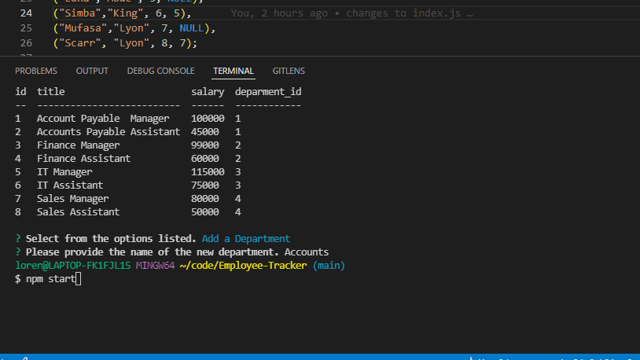

# Employee-Tracker 


 
    


## Description
We wanted to create interfaces that allow non-developers to easily view and interact with information stored in databases. 

Table of Contents
* [Installation](#installation)
* [Usage](#usage)
* [License](#license)
* [Contact](#contact)

## Installation
1. Clone Repo. https://github.com/lzvalentin/Employee-Tracker
1. To begin with open your terminal at root level.
* `npm i inquirer mysql2 console.table dotenv`

2. Once those are installed you must open MySQL. In your terminal input `mysql -u root -p` and then input your mysql password. 
* Type `SOURCE db/schema.sql`; (If no errors pop up from the schema file move forward to next step).
* Type `SOURCE db/seed.sql` (If no errors pop up from the schema file move forward to next step).
* type quit

3. type node index.js to start prompts


## Usage 



```md
GIVEN a command-line application that accepts user input
WHEN I start the application
THEN I am presented with the following options: view all departments, view all roles, view all employees, add a department, add a role, add an employee, and update an employee role
WHEN I choose to view all departments
THEN I am presented with a formatted table showing department names and department ids
WHEN I choose to view all roles
THEN I am presented with the job title, role id, the department that role belongs to, and the salary for that role
WHEN I choose to view all employees
THEN I am presented with a formatted table showing employee data, including employee ids, first names, last names, job titles, departments, salaries, and managers that the employees report to
WHEN I choose to add a department
THEN I am prompted to enter the name of the department and that department is added to the database
WHEN I choose to add a role
THEN I am prompted to enter the name, salary, and department for the role and that role is added to the database
WHEN I choose to add an employee
THEN I am prompted to enter the employee’s first name, last name, role, and manager, and that employee is added to the database
WHEN I choose to update an employee role
THEN I am prompted to select an employee to update and their new role and this information is updated in the database 
```
## License

None

## Contact

[Github](www.github.com/lzvalentin).